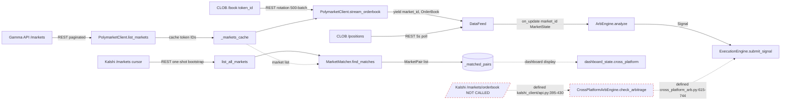
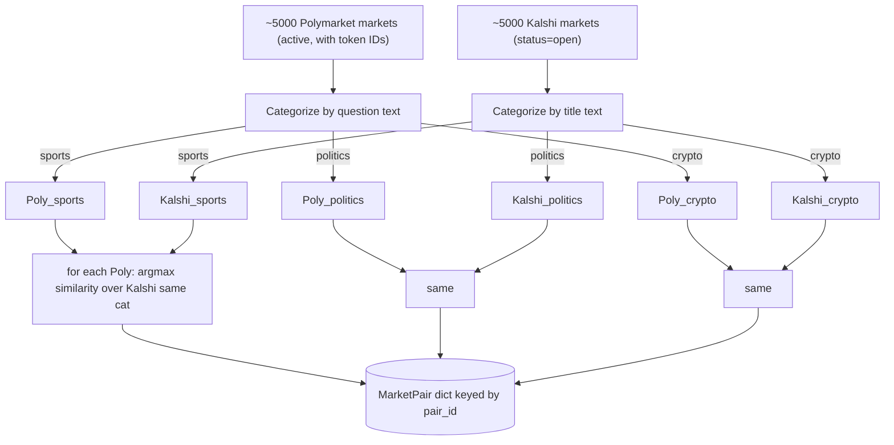
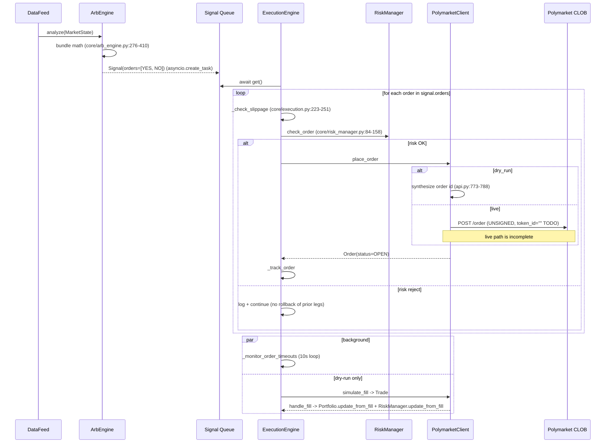

# SYSTEM_MAP.md

- **Repo:** `/Users/johnseter/Desktop/Odin/polymarket-arbitrage`
- **Pinned commit:** `7e4acc19aec11c770e9ce41c6c04634e24bfed39` (branch `main`)
- **Scope:** Full repo, every claim cited `file:line`.

---

## Phase 1 — Reconnaissance

### File tree (depth 3, prod code only)

```
.
├── main.py                          # bot entry (Polymarket-only)
├── run_with_dashboard.py            # bot + dashboard + Kalshi entry
├── test_connection.py               # creds + Gamma reachability check
├── test_real_data.py                # live order-book smoke test
├── config.yaml                      # default config (dry_run)
├── requirements.txt
├── core/
│   ├── data_feed.py                 # in-memory state + streams
│   ├── arb_engine.py                # bundle + MM detection (single-platform)
│   ├── cross_platform_arb.py        # Polymarket↔Kalshi matcher + arb math
│   ├── execution.py                 # order placement, slippage, queue
│   ├── risk_manager.py              # caps, kill switch, blacklist
│   └── portfolio.py                 # position + PnL tracking
├── polymarket_client/
│   ├── api.py                       # Gamma + CLOB client (REST polling)
│   └── models.py                    # Market, OrderBook, Order, Trade, Signal, Opportunity
├── kalshi_client/
│   ├── api.py                       # Kalshi public REST client (no auth)
│   └── models.py                    # KalshiMarket, KalshiOrderBook
├── dashboard/
│   ├── server.py                    # FastAPI app + embedded HTML/JS + DashboardState
│   └── integration.py               # push adapter bot→dashboard
├── utils/
│   ├── config_loader.py             # YAML → BotConfig dataclasses
│   ├── backtest.py                  # synthetic-data backtest engine
│   └── logging_utils.py             # rotating file handlers
└── tests/
    ├── test_arb_engine.py
    ├── test_portfolio.py
    └── test_risk_manager.py
```

### Language / framework / packaging

- **Language:** Python ≥ 3.10 (uses PEP-604 `dict[str, ...]` syntax) — `requirements.txt:1-2`.
- **No package manager beyond pip** — `requirements.txt:5-28`.
- **Frameworks:** `asyncio` runtime; `httpx` for REST, `websockets` for WS, `FastAPI`+`uvicorn` for dashboard, `pydantic` listed but unused (no `BaseModel` imports), `pyyaml` for config — `requirements.txt:5-20`.

### Entry points

| Entry | Mode | File |
|---|---|---|
| `python main.py [--live\|--dry-run\|--backtest]` | Polymarket-only headless | `main.py:398-460` |
| `python run_with_dashboard.py [--live] [--port N]` | Bot + FastAPI dashboard + Kalshi matching | `run_with_dashboard.py:482-530` |
| `python test_connection.py -c config.yaml` | Sanity check API creds / Gamma | `test_connection.py:1-130` |
| `python test_real_data.py` | One-shot live order-book fetch | `test_real_data.py:1-59` |
| `pytest tests/` | Unit tests | `tests/` |

No cron, no daemon supervisor, no systemd unit.

### External dependency map (grouped by role)

| Role | Library | Used at |
|---|---|---|
| HTTP REST | `httpx` | `polymarket_client/api.py:18,156,200`; `kalshi_client/api.py:15,60,90` |
| WebSocket | `websockets` | `polymarket_client/api.py:19,708` (declared but unused in steady state — see Phase 3) |
| Web framework | `fastapi`, `uvicorn` | `dashboard/server.py:15-17`; `run_with_dashboard.py:23,192-200` |
| Config | `pyyaml` | `utils/config_loader.py:13,147` |
| Numerics | std-lib only (`math`, `random`, `difflib.SequenceMatcher`) | `core/cross_platform_arb.py:17,380`; `polymarket_client/api.py:536`; `utils/backtest.py:10,126` |
| Chain / RPC | **none** | — bot does not sign or submit on-chain transactions; `private_key` field exists but `place_order` returns a synthetic order id — `polymarket_client/api.py:758-814` |
| Persistence | **none** | All state in-process (`dict`s in `DataFeed`, `Portfolio`, `RiskManager`) — `core/data_feed.py:51-54`; `core/portfolio.py:84-93` |
| Observability | std `logging` + custom rotating file handlers in `utils/logging_utils.py`; no metrics/tracing exporter |

### One-screen overview

Two async entrypoints share a five-component pipeline (`Client → DataFeed → ArbEngine → ExecutionEngine` with `RiskManager` + `Portfolio` orthogonal). `run_with_dashboard.py` adds a Kalshi client, a `MarketMatcher`, a `CrossPlatformArbEngine`, and a FastAPI server running in the same event loop (uvicorn `serve()` is `asyncio.create_task`-ed at `run_with_dashboard.py:200`, contradicting the `CLAUDE.md` note that the server runs in a `threading.Thread`). All trading state is in-memory; restart loses positions, PnL, and matched-pair cache.

---

## Phase 2 — Domain classification

| Attribute | Value | Citation |
|---|---|---|
| Arbitrage type (single-platform) | **Bundle / synthetic-complement arbitrage** (YES + NO ≠ $1) + **passive market-making** | `core/arb_engine.py:276-410, 465-574` |
| Arbitrage type (cross-platform) | **CEX-CEX style** between Polymarket CLOB and Kalshi exchange — detection only, no execution wiring | `core/cross_platform_arb.py:615-744` (defined); never called — see Phase 8 |
| Triangular / cyclic | None | `core/cross_platform_arb.py` has no path finder |
| Asset class | Binary prediction-market shares (YES, NO ∈ [$0, $1]) | `polymarket_client/models.py:31-34, 37-43` |
| Venues integrated | 2 — Polymarket (Gamma + CLOB), Kalshi (`api.elections.kalshi.com/trade-api/v2`) | `utils/config_loader.py:24-27`; `kalshi_client/api.py:36` |
| Quote currency | USD-denominated $0–$1 share prices | Polymarket: floats from `/book` `polymarket_client/api.py:509-516`; Kalshi: cents-to-dollars `/100.0` `kalshi_client/api.py:289-290, 350, 361` |
| Decimals | Floats throughout — no `Decimal`. Tick size 0.01. | `core/arb_engine.py:40, 512-513`; `polymarket_client/models.py:48-53` |
| Latency profile | **Poll-based, rotating batches** (not tick or event-driven) — Polymarket CLOB rotates 500 markets at a time, 20 per request batch, 50ms intra-batch, 300ms inter-batch, 2s rotation delay | `polymarket_client/api.py:613-617, 626-667` |
| Tick budget | None enforced. ArbEngine measures *opportunity duration*: bucketed <100ms, <500ms, <1s, >1s | `core/arb_engine.py:208-217` |

---

## Phase 3 — Data ingestion

### Polymarket — markets (discovery)

- **Transport:** REST polling against Gamma API (`https://gamma-api.polymarket.com/markets`).
  - `polymarket_client/api.py:223-289` `list_markets()`: paginated, `limit=100`, `offset+=100`, cap `max_markets=5000`, sleep `0.15s` between pages.
  - Filter defaults: `closed=false`, `order=volume24hr`, `ascending=false` — `polymarket_client/api.py:233-235`.
- **Normalizer:** `_parse_market()` at `polymarket_client/api.py:319-367`. Key field: `clobTokenIds` arrives as a JSON-string-of-array `'["yes_id","no_id"]'`; parsed at `polymarket_client/api.py:329-344`. Position [0]=YES, [1]=NO — this ordering is **assumed**, not verified.
- **Cache:** `self._markets_cache: dict[str, Market]` — `polymarket_client/api.py:145, 265, 601-604`. Token IDs are pulled from cache to drive order-book polling.

### Polymarket — order books (steady state)

- **Transport:** REST polling against CLOB `GET /book?token_id=…` — `polymarket_client/api.py:494-501`.
- **NOT WebSocket** in steady state. `_connect_websocket` at `polymarket_client/api.py:701-728` is defined and wires a subscribe payload, but is **never called** from `stream_orderbook`. Steady-state path is `polymarket_client/api.py:625-667` (REST rotation).
- **Rotation:**
  - `active_batch_size = 500`, `markets_per_request_batch = 20`, `request_delay = 0.05`, `batch_delay = 0.3`, `rotation_delay = 2.0` — `polymarket_client/api.py:613-617`.
  - Cycle restarts on overflow: `current_offset = 0; logger.info("Completed full market cycle…")` — `polymarket_client/api.py:662-665`.
- **Per-token book parse:** `_fetch_token_orderbook()` at `polymarket_client/api.py:493-532` — keeps top 10 levels each side.
- **Failure handling:**
  - HTTP retry with linear backoff (`retry_delay * (attempt + 1)`) on 5xx — `polymarket_client/api.py:208-221`.
  - Per-market fetch errors are **silently swallowed**: `except Exception: continue` — `polymarket_client/api.py:655-657`. No circuit breaker, no per-market staleness blacklist.
  - Stream-level recovery: 1-second sleep then reconnect loop — `core/data_feed.py:160-165`.

### Polymarket — positions

- **Transport:** REST poll every 5 s (`position_refresh_interval=5.0`) — `core/data_feed.py:40, 91-94, 167-176`.
- **Endpoint:** `GET /positions` — `polymarket_client/api.py:741`. Note: positions API path is unauthenticated in code; real Polymarket requires L1/L2 signatures — `polymarket_client/api.py:179-181` only sets a `POLY_API_KEY` header, no HMAC/signature. See Attack Surface.

### Kalshi — markets

- **Transport:** REST polling `GET /trade-api/v2/markets` with cursor pagination — `kalshi_client/api.py:169-210`.
- **No auth required.** Public data — `kalshi_client/api.py:60-63` (only `Accept: application/json`).
- **Pagination:** `limit=1000`, follow `cursor` until empty, cap `max_markets=10000`, sleep `0.2s` between pages — `kalshi_client/api.py:212-260`.
- **Rate-limit handling:** 429 → exponential backoff `wait = 2 ** attempt` — `kalshi_client/api.py:94-97`. 404 → return `{}` silently — `kalshi_client/api.py:98-100`.
- **Cents → dollars:** all prices `data.get("yes_price", 0) / 100.0` — `kalshi_client/api.py:289-290`.

### Kalshi — order books

- **Transport:** `GET /markets/{ticker}/orderbook` — `kalshi_client/api.py:337`.
- **Critical asymmetry — Kalshi only returns bids.** Asks are **derived** as `1.0 - best_bid_other_side` — `kalshi_client/models.py:54-62, 79-96, 105-123`. This is mathematically valid for a binary YES/NO contract where the issuer creates the synthetic ask side: a $0.40 NO bid implies someone will sell YES at $0.60.
- **Stream:** `KalshiClient.stream_orderbooks()` at `kalshi_client/api.py:395-430` — **defined but never called from `run_with_dashboard.py`**; see Phase 8 + Attack Surface.

### Unified data structures

`PriceLevel(price, size)` → `OrderBookSide(levels=[PriceLevel])` → `TokenOrderBook(token_type, bids, asks)` → `OrderBook(market_id, yes, no, timestamp)` — `polymarket_client/models.py:45-159`.

`KalshiOrderBook.to_unified_orderbook()` projects Kalshi's bid-only book into the same `OrderBook` shape with derived asks — `kalshi_client/models.py:98-131`.

### Timestamping / clock skew / sequence gaps

- Local `datetime.utcnow()` stamped on every `OrderBook` construction — `polymarket_client/api.py:519, 645-650`; `kalshi_client/api.py:373`.
- **No server timestamps consumed**, no clock-skew correction, no sequence numbers.
- Staleness queryable per market: `DataFeed.get_staleness()` — `core/data_feed.py:253-260` — but **not consumed by ArbEngine before signaling**.

### Data-flow diagram



Dashed red edges = code exists, never executed at runtime.

---

## Phase 4 — Market matching (core)

### Cross-venue identity strategy

There is **no canonical instrument ID mapping**. Matching is text-similarity-based on `Market.question` (Polymarket) vs `KalshiMarket.title` — `core/cross_platform_arb.py:531-534`.

### Data structures

- `MarketPair` dataclass: `polymarket_id`, `kalshi_ticker`, both texts, `similarity_score`, `category`, `matched_at` — `core/cross_platform_arb.py:25-41`.
- Storage: `MarketMatcher._matched_pairs: dict[str, MarketPair]` keyed by `pair_id = f"poly:{poly_id}|kalshi:{ticker}"` — `core/cross_platform_arb.py:176, 39-41, 567`.
- **Not a graph**, not an adjacency matrix. A flat dict of one-to-one matches (greedy best-of, see below).

### Path / pair discovery

- **Algorithm:** category-bucketed greedy best-match. For each Polymarket market, scan all Kalshi markets *in the same category* and keep the single best `similarity_score`. Threshold `min_similarity = 0.5` — `core/cross_platform_arb.py:168, 526-572`.
- **Complexity:** `O(Σ_cat |P_cat| × |K_cat|)`. Code logs both the bucketed total and the all-to-all total (`core/cross_platform_arb.py:504-510`) to demonstrate the pruning.
- **Categorizer:** rule-based keyword classifier with hard-coded category order (politics first to avoid "election" matching sports) — `core/cross_platform_arb.py:411-452`. Categories: `politics`, `crypto`, `finance`, `sports`, `entertainment`, `tech`, `other`. Markets in `other` are dropped — `core/cross_platform_arb.py:515-517`.

### Similarity calculation — multi-strategy waterfall

`MarketMatcher.calculate_similarity()` at `core/cross_platform_arb.py:348-409`. Strategies in priority order:

1. **Sports team + date** — `is_sports_match()` at `core/cross_platform_arb.py:278-311`. Two teams matched via canonical NFL/NBA dictionaries (`core/cross_platform_arb.py:99-166`); if exact pair + date match → score `0.95`. If teams match but dates don't → return `False, 0.3` (anti-match guard). Date extracted from text via month-name and `M/D/Y` regex — `core/cross_platform_arb.py:242-270`. **`extract_date` defaults the year to `'2024'`** if the text omits it — `core/cross_platform_arb.py:257` — a stale assumption (we are now in 2026).
2. **Person + action** — `is_same_person_event()` at `core/cross_platform_arb.py:313-346`. Regexes for politicians, tech CEOs, Fed chairs; same person + same action-verb class → `0.85`, same person only → `0.6`.
3. **Fuzzy text** — `difflib.SequenceMatcher` ratio on noise-stripped lower-cased text — `core/cross_platform_arb.py:185-191, 376-380`.
4. **Entity overlap bonus** — capitalized words + numbers + political/crypto term sets — `core/cross_platform_arb.py:209-231, 383-389`.
5. **Category boosts** — `+0.15` if both mention same sport keyword, `+0.20` if both mention same crypto coin — `core/cross_platform_arb.py:394-407`.

### Eligibility filters

| Filter | Where | Notes |
|---|---|---|
| Polymarket `active=True` | `core/cross_platform_arb.py:476` | Comes from Gamma `active` field |
| Kalshi `status in ('open','active')` | `core/cross_platform_arb.py:477`; `kalshi_client/models.py:42-45` | |
| Token-id presence | `polymarket_client/api.py:262` | Markets without parseable `clobTokenIds` are silently dropped |
| Category ≠ `other` | `core/cross_platform_arb.py:515-517` | Hard-coded category whitelist |
| `min_similarity ≥ 0.5` | `core/cross_platform_arb.py:168, 557` | Note: `config.yaml:86` sets `min_match_similarity: 0.6` but the value is **never threaded into `MarketMatcher.__init__`** — see Attack Surface |
| Per-trade whitelist / blacklist | `core/risk_manager.py:95-103` | Applied at order-submit time, not at match time |

### Matching pseudocode (with citations)

```python
# core/cross_platform_arb.py:454-575
async def find_matches(poly_markets, kalshi_markets, on_progress):
    active_poly   = [m for m in poly_markets   if m.active]                # :476
    active_kalshi = [m for m in kalshi_markets if m.is_active]             # :477

    poly_by_cat   = bucket_by(active_poly,   self._categorize_market(m.question)) # :482-487
    kalshi_by_cat = bucket_by(active_kalshi, self._categorize_market(m.title))    # :489-494

    matches = []
    for category in ['sports','politics','crypto','finance','entertainment','tech']:  # :515
        for p in poly_by_cat.get(category, []):
            best, best_score = None, 0.0
            for k in kalshi_by_cat.get(category, []):
                s = self.calculate_similarity(p.question, k.title)         # :531-534
                if s > best_score: best, best_score = k, s                 # :536-538
                checked += 1
                if checked % 500 == 0: await asyncio.sleep(0.01)           # :543-544
            if best and best_score >= self.min_similarity:                 # :557
                matches.append(MarketPair(p.market_id, best.ticker, ...))  # :558-566
    return matches
```

### Matching topology



---

## Phase 5 — Opportunity calculation

### Single-platform — Bundle arbitrage (the live path)

Source: `core/arb_engine.py:276-410`. Tests at `tests/test_arb_engine.py:82-163` confirm behavior.

**Gross edge:**

$$
\text{gross\_edge}_{long}  = 1 - (a_{YES} + a_{NO}) \quad\text{(buy both at ask)}
$$

$$
\text{gross\_edge}_{short} = (b_{YES} + b_{NO}) - 1 \quad\text{(sell both at bid)}
$$

— `core/arb_engine.py:314, 354`.

**Fee model (per-leg, percentage of notional):**

$$
f = \frac{\text{taker\_fee\_bps}}{10000}
$$

$$
\text{fee\_cost}_{long}  = f \cdot (a_{YES} + a_{NO})
$$

$$
\text{fee\_cost}_{short} = f \cdot (b_{YES} + b_{NO})
$$

$$
\text{gas\_cost} = 2 \cdot \text{gas\_per\_order}
$$

— `core/arb_engine.py:300-308`. Defaults: `taker_fee_bps=150` (1.5%), `gas_per_order=$0.02` — `core/arb_engine.py:52-54`.

**Net edge:**

$$
\text{net\_edge} = \text{gross\_edge} - \text{fee\_cost} - \text{gas\_cost}
$$

**Trigger:** `net_edge ≥ min_edge` (default `0.01`) — `core/arb_engine.py:317, 357`.

**Sizing (closed-form, capped by liquidity):**

$$
\text{size}_{suggested} = \max\!\left(\text{min\_size},\; \min\!\left(\frac{\text{default\_size}}{\max(p_{YES}, p_{NO})},\; \min(L_{YES}, L_{NO})\right)\right)
$$

— `core/arb_engine.py:321-329, 360-369`. `L_*` is the size at the best level (`best_ask_size` / `best_bid_size`).

**Cooldown / dedup:** per `(market_id, opportunity_type)`, 2-second cooldown after firing — `core/arb_engine.py:397-402`.

**Slippage model:** None. Order is placed at the snapshot ask/bid; the engine does **not** walk the book. If size > `best_ask_size`, the order will fail or partial-fill at the venue. Slippage check at `core/execution.py:223-251` is a *staleness* check against the opportunity snapshot, not a book-walk.

**Profitability threshold:** absolute net edge in dollars (`min_edge = 0.01` is "1¢ per share of bundle", since YES+NO bundle settles to exactly $1.00). The threshold is **not bps-of-notional** — it's absolute.

### Single-platform — Market making

Source: `core/arb_engine.py:465-574`.

- **Trigger:** `spread = best_ask - best_bid ≥ min_spread` (default `0.05`) — `core/arb_engine.py:500`.
- **Quote prices:** one tick inside the spread —
  $$\text{our\_bid} = b + \tau, \quad \text{our\_ask} = a - \tau, \quad \tau=\text{tick\_size}=0.01$$
  — `core/arb_engine.py:512-513`.
- **Guards:** require `our_ask > our_bid` AND `our_spread ≥ 2τ` — `core/arb_engine.py:516-521`.
- **Sizing:** `default_order_size / mid_price`, clamped to `[min_size, max_size]` — `core/arb_engine.py:524-526`.
- **Expected edge:** `our_spread / 2` per side (recorded for stats only; no inventory/skew model) — `core/arb_engine.py:533`.
- **Cooldown:** 5s per `(market_id, token_type)` — `core/arb_engine.py:504-509`.
- **No fees in MM math.** Maker rebate / fee not modeled here even though `maker_fee_bps=0` is configured — `core/arb_engine.py:52`.
- Disabled by default in production config: `config.yaml:37`.

### Cross-platform — defined but not wired

Source: `core/cross_platform_arb.py:615-744`. **Note: see Phase 8 — this method is never called at runtime.**

For each matched pair, evaluates **four directional legs** (Buy YES Poly / Sell YES Kalshi, etc.). For each leg:

$$
\text{gross} = p_{sell} - p_{buy}
$$

$$
\text{fees} = p_{buy} \cdot f_{buy} + p_{sell} \cdot f_{sell} + 2 \cdot \text{gas\_cost}
$$

$$
\text{net} = \text{gross} - \text{fees}
$$

— `core/cross_platform_arb.py:653-738`. Defaults: `polymarket_taker_fee=0.015`, `kalshi_taker_fee=0.01`, `gas_cost=0.02` — `core/cross_platform_arb.py:593-595`.

**Edge pct:** `net_edge / buy_price` — `core/cross_platform_arb.py:778`.

**Sizing:** `min(buy_liquidity, sell_liquidity, $100)` — `core/cross_platform_arb.py:763-766`. The `$100` cap is hard-coded, not config-driven. `buy_liquidity` for Kalshi reads `kalshi_ob.yes.asks.best_size` — note Kalshi asks are *derived*, so `best_size` is the size of the opposite-side bid copied across — `kalshi_client/models.py:107-110`.

**Selection:** keeps the single best (highest net) of the four legs — `core/cross_platform_arb.py:647-738`.

### Math summary table

| Quantity | Formula | Where |
|---|---|---|
| Bundle long gross | `1 - (ask_yes + ask_no)` | `core/arb_engine.py:314` |
| Bundle short gross | `(bid_yes + bid_no) - 1` | `core/arb_engine.py:354` |
| Bundle fee (per leg) | `taker_fee_bps/10000 × leg_price`, summed | `core/arb_engine.py:300-308` |
| Bundle net edge | `gross - fees - 2·gas` | `core/arb_engine.py:315, 355` |
| Bundle size | `min(default/max_price, min(L_yes, L_no))`, floored at `min_size` | `core/arb_engine.py:321-329` |
| MM bid | `best_bid + tick` | `core/arb_engine.py:512` |
| MM ask | `best_ask - tick` | `core/arb_engine.py:513` |
| MM expected edge | `our_spread / 2` | `core/arb_engine.py:533` |
| Cross-platform gross | `p_sell - p_buy` | `core/cross_platform_arb.py:654,676,698,720` |
| Cross-platform fee | `p_buy·f_buy + p_sell·f_sell + 2·gas` | `core/cross_platform_arb.py:655-657` |
| Cross-platform edge_pct | `net / buy_price` | `core/cross_platform_arb.py:778` |
| Kalshi derived ask | `1.0 - best_bid_other_side` | `kalshi_client/models.py:79-96` |

---

## Phase 6 — Risk & filters

### Pre-trade gate ordering

`RiskManager.check_order()` runs in this exact order — `core/risk_manager.py:84-158`:

1. Kill switch — `:91-93`
2. Blacklist — `:95-98`
3. Whitelist (if non-empty) — `:100-103`
4. Min 24h volume (when `trade_only_high_volume`) — `:105-113`
5. Per-market exposure cap — `:115-126`
6. Global exposure cap — `:128-136`
7. Daily-loss cap (also flips kill switch) — `:138-146`
8. Drawdown cap (also flips kill switch) — `:148-156`

Tests confirm the ordering and pass-fail semantics: `tests/test_risk_manager.py:60-92, 98-115`.

### Position / inventory storage

| What | Where | Update path |
|---|---|---|
| Per-market notional | `RiskManager._market_exposure: dict[str, float]` | `core/risk_manager.py:68, 168-184` |
| Global notional | `RiskState.global_exposure` | `core/risk_manager.py:49, 175-178` |
| Per-(market, token) position with avg cost + realized PnL | `Portfolio._positions: dict[str, dict[TokenType, PortfolioPosition]]` | `core/portfolio.py:84, 97-138` |
| Trade history | `Portfolio._trades: list[Trade]`, `RiskManager._session_trades: list[Trade]` | `core/portfolio.py:87, 130`; `core/risk_manager.py:75, 190` |
| Volume cache (for filter) | `RiskManager._market_volumes: dict[str, float]` | `core/risk_manager.py:71, 215-221` — **never populated** at runtime; `set_market_volumes()` is only called in tests (`tests/test_risk_manager.py:32-36`). With default config `trade_only_high_volume=False` (`config.yaml:63`), this is benign. |

### Cost-basis / PnL update path

`Portfolio.update_from_fill()` — `core/portfolio.py:97-138`. Long-only flow → `_process_buy` (`:140-179`), short-cover and short-add handled inline; sell flow → `_process_sell` (`:181-221`). Realized PnL is incremented only on position-reducing legs. Trade-level fees are subtracted from cash at `core/portfolio.py:124-127` but **not netted into `realized_pnl`**; net PnL surfaces only via `get_pnl()['net_pnl']` — `core/portfolio.py:298-299`.

### Hedging

None. There is no auto-hedge after a half-filled bundle. If only one leg of a bundle-long fills, the unhedged YES (or NO) sits in the portfolio at the original avg cost, and the cooldown prevents re-firing on the same opportunity type for 2 seconds — `core/arb_engine.py:402`.

### Concurrency model

- **All trading code is `asyncio` on a single event loop.** No locks anywhere.
- **Signal queue:** `asyncio.Queue[Signal]` consumed by a single `_process_signals` worker — `core/execution.py:87-88, 130-149`. Single-consumer guarantees serial order execution.
- **No idempotency keys / nonces.** Order placement generates a UUID locally (`core/execution.py` via client at `polymarket_client/api.py:773`); duplicate signals during a cooldown window are deduped only by the engine-side `_opportunity_cooldown` map — `core/arb_engine.py:397-402`.
- **Risk state updates race with `check_order`:** `update_position()` and `check_order()` are not synchronized but the event loop ensures cooperative serialization. Risk: any `await` inside `_handle_place_orders` (`core/execution.py:162-213`) between check and place lets other signals interleave. See Attack Surface.

### Kill switch

- Triggered automatically by `update_pnl` (daily loss, drawdown) — `core/risk_manager.py:206-213`.
- Also re-checked inside `check_order` and trips the switch if state has crossed since last check — `core/risk_manager.py:139-156`.
- Reset only via explicit `reset_kill_switch()` — `core/risk_manager.py:229-233`. No auto-recovery, no time-based reset.
- `auto_unwind_on_breach` flag exists in config (`utils/config_loader.py:65`) but **no unwind logic exists** anywhere in the codebase.

---

## Phase 7 — Execution

### Order construction

- Constructed by `ArbEngine` as `list[dict]` order-spec attached to a `Signal` — `core/arb_engine.py:412-463, 547-562`.
- Materialized into `Order` objects (with UUID, status) by `PolymarketClient.place_order()` — `polymarket_client/api.py:758-814`.
- **In dry-run:** synthetic order, stored in `_simulated_orders` dict, returned immediately — `polymarket_client/api.py:785-788`.
- **In live mode:** a `POST /order` payload is built at `polymarket_client/api.py:796-804` but with `token_id=""` (a TODO) and **no signature** of the private key. There is no integration with the Polymarket CLOB EIP-712 signing scheme — see Attack Surface.

### Slippage / staleness gate

`ExecutionEngine._check_slippage()` — `core/execution.py:223-251`. Compares the order's intended price against the opportunity snapshot's best bid/ask. Fails the order if `|slippage| > slippage_tolerance` (default `0.02`). **It does NOT consult the current order book** — it only compares the intended price against the *snapshot at signal time*. A 50ms book move is invisible here. The slippage check is effectively a sanity check that the engine generated a self-consistent order.

### Submission strategy

- **Per-leg, sequential** within a signal — `core/execution.py:164-213`.
- **Not atomic.** Bundle arb places two orders one after the other; if leg 1 succeeds and leg 2 fails (risk reject, slippage, API error), the engine has a naked single-leg position. There is no flashloan, no MEV bundle, no rollback.
- Retry: 3 attempts with `retry_delay=0.5s` per leg — `core/execution.py:38, 265-289`.
- Submission queue is a single `asyncio.Queue` serial consumer — `core/execution.py:130-149`.

### Confirmation & partial fills

- **Dry-run fill loop:** background `_simulate_fills()` at `main.py:219-240` / `run_with_dashboard.py:232-255`. Every 2 s, each open order rolls a die against `fill_probability` (default `0.8`); on success `client.simulate_fill()` generates a `Trade` with a flat 1.5% fee — `polymarket_client/api.py:913-959`.
- **Live confirmation:** no path — `place_order()` returns synchronously with `status=OPEN`; there is no listener for fill events, no WS subscription to user trades, no polling of `/orders` to reconcile. `handle_fill()` exists (`core/execution.py:388-413`) but is wired only to the simulated-fill loop.
- **Partial fills:** modelled in dry-run (`Order.filled_size += trade.size`, status → `PARTIALLY_FILLED` or `FILLED`) — `core/execution.py:392-402`.
- **Order timeout:** every 10 s, orders older than `order_timeout_seconds` (default 60s) are cancelled — `core/execution.py:365-386`.

### Rollback / unwind

None. See Phase 6 hedging note.

### Execution sequence diagram



---

## Phase 8 — System map

```mermaid
flowchart LR
  subgraph Polymarket
    GAMMA[Gamma /markets]:::ext
    CLOB[CLOB /book]:::ext
    POS[CLOB /positions]:::ext
  end
  subgraph Kalshi
    KMARKETS[/markets cursor/]:::ext
    KOB[/markets/orderbook/]:::ext
  end

  GAMMA -->|REST, list[Market]| PMC[PolymarketClient]
  CLOB  -->|REST poll 500-rotation, OrderBook| PMC
  POS   -->|REST 5s poll, dict positions| PMC

  PMC -->|Market, OrderBook| DF[DataFeed in-memory]
  DF -->|on_update market_id, MarketState| AE[ArbEngine.analyze]
  AE -->|Signal| SQ[(asyncio.Queue signal)]
  SQ --> EX[ExecutionEngine]
  EX --> RM[RiskManager.check_order]
  RM -->|bool| EX
  EX -->|place_order| PMC
  PMC -.dry_run.-> SIM[(_simulated_orders)]
  PMC -.live TODO unsigned.-> CLOB
  EX -->|handle_fill Trade| PORT[Portfolio.update_from_fill]
  EX -->|update_from_fill| RM

  KMARKETS -->|REST cursor paginated| KC[KalshiClient]
  KC -->|list[KalshiMarket]| MATCH[MarketMatcher.find_matches]
  DF -->|polymarket markets| MATCH
  MATCH -->|list[MarketPair] one-shot| CPC[(CrossPlatformArbEngine.matcher._matched_pairs)]
  CPC -.never.-> CPCheck[check_arbitrage NOT WIRED]:::dead
  KOB -.never polled.-> CPCheck:::dead
  CPCheck -.->|would emit| EX

  DF --> DBI[DashboardIntegration]
  AE --> DBI
  EX --> DBI
  RM --> DBI
  PORT --> DBI
  DBI --> DS[(dashboard_state)]
  DS -->|/ , /api/*, /ws| FASTAPI[FastAPI + WebSocket clients]

  classDef ext fill:#eef,stroke:#88a
  classDef dead stroke:#c00,stroke-dasharray:5 5,color:#c00
```

**Edge data-type legend:**

| Edge | Payload |
|---|---|
| Gamma → PMC | JSON, parsed to `Market` (`polymarket_client/api.py:319-367`) |
| CLOB → PMC | JSON `{bids:[…], asks:[…]}` → `TokenOrderBook` (`api.py:493-532`) |
| PMC → DF | `tuple[market_id, OrderBook]` via async generator (`api.py:582-674`) |
| DF → AE | `MarketState(market, order_book, positions, ...)` callback (`core/data_feed.py:192-212`) |
| AE → Queue | `Signal(action, market_id, orders=list[dict], opportunity)` (`core/arb_engine.py:453-463`) |
| EX → PMC | `Order` dataclass (`core/execution.py:267-289`) |
| EX → PORT/RM | `Trade` (`core/execution.py:388-413`) |
| KalshiClient → Matcher | `list[KalshiMarket]` (`kalshi_client/api.py:212-260`) |
| Matcher → cache | `list[MarketPair]` (`core/cross_platform_arb.py:556-572`) |
| DBI → dashboard_state | `dict` snapshots (`dashboard/integration.py:84-164`) |

**Async boundaries:**
- `_orderbook_task`, `_position_task` in `DataFeed` — `core/data_feed.py:85-94`.
- `_processing_task`, `_monitor_order_timeouts` in `ExecutionEngine` — `core/execution.py:99-105`.
- `_simulate_fills`, `_start_kalshi_monitoring`, `_run_matching_background` in the dashboard runner — `run_with_dashboard.py:158, 182, 311`.
- Uvicorn `serve()` is an `asyncio.Task` on the same loop — `run_with_dashboard.py:200`. (Contradicts the CLAUDE.md note about `threading.Thread`.)
- Matching is offloaded to a `concurrent.futures.ThreadPoolExecutor(max_workers=1)` with its own event loop to keep the dashboard responsive — `run_with_dashboard.py:313-363`.

**Persistence:** none. All state in-process Python dicts/lists.

**External I/O:**
- `httpx.AsyncClient` (Polymarket Gamma, CLOB, Kalshi REST) — `polymarket_client/api.py:156`; `kalshi_client/api.py:60`.
- `websockets.connect` declared but **never reached** in the steady-state code path — `polymarket_client/api.py:701-728`.
- FastAPI WebSocket fan-out to browser clients — `dashboard/server.py:199-232`.

---

## OPEN QUESTIONS

1. **Is `CrossPlatformArbEngine.check_arbitrage` ever called?** Grep shows zero call sites in repo (`grep -rn "check_arbitrage"` returns only the definition at `core/cross_platform_arb.py:615`). The cross-platform engine is instantiated (`run_with_dashboard.py:104`), its `matcher` is used to find pairs, and `get_stats()` is called for the shutdown banner (`run_with_dashboard.py:423`) — but nothing ever polls Kalshi order books and feeds them in. Is this intentional (matching-only, no execution yet) or a missing wiring?
2. **Is there a Kalshi order-book polling loop anywhere?** `KalshiClient.stream_orderbooks` (`kalshi_client/api.py:395-430`) is defined but its only consumer would be `CrossPlatformArbEngine.check_arbitrage` — also unwired. Was this intended to be hooked up?
3. **Live order placement is a TODO.** `polymarket_client/api.py:758-814` does not sign with `private_key` and writes `token_id=""` in the payload. How is live trading supposed to work — is there an out-of-tree client, or has the bot never traded live?
4. **`config.mode.min_match_similarity` is read but not propagated.** Set in `config.yaml:86` and on the dataclass `utils/config_loader.py:75`, but `CrossPlatformArbEngine.__init__` at `run_with_dashboard.py:104-106` only forwards `min_edge`, and `MarketMatcher()` is constructed with default `min_similarity=0.5` (`core/cross_platform_arb.py:611`). Was this a recent regression?
5. **`Portfolio.update_prices()` is never called.** `core/portfolio.py:223-232` is the only path that populates `_current_prices`, and no caller exists. Therefore `total_unrealized_pnl` (`stats.total_unrealized_pnl`) is always `0.0` in production, and the drawdown calc fed to risk only sees realized PnL.
6. **YES/NO token ordering in `clobTokenIds`.** The Gamma response is treated as `[yes_id, no_id]` at `polymarket_client/api.py:338-339`. The Gamma API does not appear to guarantee this ordering — `outcomes` is parsed but `outcome_prices` is read into a local at `polymarket_client/api.py:349` and discarded without sanity-checking which index is YES. Could the YES/NO sides be inverted for some markets?
7. **`extract_date` default year is `'2024'`** (`core/cross_platform_arb.py:257`). Today is 2026 — does this still get correct date matches for sports markets that omit the year, or does it incorrectly anti-match by claiming dates differ?
8. **Risk-manager exposure accounting on sells.** `update_position` decrements exposure on `size_delta < 0` (`core/risk_manager.py:176-178`). For a short-open (sell that adds to a short position), exposure should *increase*. The current code subtracts notional, which clamps to zero (`:181-182`). Is this intentional (treat shorts as zero exposure) or a bug?
9. **Dashboard server thread vs task.** `CLAUDE.md` (in the repo root, not committed at HEAD per `git status`) says the FastAPI server runs in a `threading.Thread`. The actual code starts uvicorn via `asyncio.create_task(self._server.serve())` (`run_with_dashboard.py:200`). Which is canonical?
10. **`test_connection.py` and `test_real_data.py` reference Gamma + CLOB but were not read in detail.** Do they exercise authenticated endpoints?

## ATTACK SURFACE

| Risk | Where | Why it bites |
|---|---|---|
| **No live order signing** | `polymarket_client/api.py:758-814` | If a user flips `trading_mode: live` with valid creds in env, the engine will keep firing `POST /order` with `token_id=""` and no EIP-712 signature. Polymarket rejects, but every detected opportunity becomes a retry storm (3 retries × `retry_delay=0.5s`, no circuit breaker). Could trigger rate-limit bans or throttling. |
| **Cross-platform arb is dead code** | `core/cross_platform_arb.py:615-744` (defined), no caller | If someone reads `README` / `CLAUDE.md` and trusts the cross-platform claim, they'll expect arb signals that never fire. |
| **No partial-fill rollback for bundle legs** | `core/execution.py:162-213` | Bundle is two `place_order` calls in sequence. If leg 1 fills and leg 2 is rejected (risk, slippage, API), you hold a naked YES *or* NO at full size with no unwind logic. `auto_unwind_on_breach` flag exists (`utils/config_loader.py:65`) but no implementation. |
| **Stale data leaks into signals** | `core/data_feed.py:253-260` defines `get_staleness`, never consumed | An order-book that hasn't refreshed in 30+ seconds will still produce a `MarketState` and feed into `ArbEngine`. Old prices + cooldown reset = potential to act on phantom edges, particularly during rotation gaps (rotation cycle on 5000 markets ≈ minutes). |
| **Rotation gaps create blind spots** | `polymarket_client/api.py:625-667` | With 500-market `active_batch_size` and ~25 batches per cycle, each market is refreshed roughly every 60–120 s. Edges that appear and decay inside one rotation are invisible. ArbEngine timing histogram (`core/arb_engine.py:208-217`) cannot measure what it cannot see. |
| **Decimals & float math** | `polymarket_client/models.py:48-53` | Floats throughout, no quantization to tick. `our_bid = best_bid + tick_size` (`core/arb_engine.py:512`) can produce non-tick prices (e.g. `0.43 + 0.01 = 0.44000000000001`). Polymarket CLOB will reject off-tick orders. |
| **Kalshi derived-ask assumption** | `kalshi_client/models.py:79-96` | Treats `1.0 - bid_no` as a real YES ask. This is correct *in theory* (issuer creates the synthetic) but the derived `best_ask_size` is just the size of the opposing bid copied across (`:107-110`). It's not actually the available ask depth at the exchange. Cross-platform sizing reads this as available liquidity (`core/cross_platform_arb.py:763`). |
| **Sequence number / clock skew absent** | All over | Order-book updates carry no sequence number from the venue. The bot cannot detect a reordered or replayed update; under network jitter, an older snapshot could overwrite a newer one in `DataFeed._order_books`. |
| **YES/NO inversion risk** | `polymarket_client/api.py:329-344` | Assumes `clobTokenIds[0] == yes_id`. If a market lists `["No","Yes"]` in `outcomes`, the engine will buy NO when it thinks it's buying YES. The `outcome_prices` parsed at `:348` could be used to cross-check but isn't. |
| **Year defaults to 2024 in date matcher** | `core/cross_platform_arb.py:257` | Sports markets without explicit year (e.g. "Cowboys vs Eagles Dec 8") will be tagged 2024, while Kalshi tickers like `KXNFLGAME-25DEC08` will yield 2025. `dates_match` returns False → engine refuses to match valid pairs. With today being 2026, this is silently dropping current-season matches. |
| **Risk cooldown / kill switch is one-way** | `core/risk_manager.py:206-213, 229-233` | No auto-reset. After a transient drawdown breach (mark-to-market on stale prices, see above), the kill switch latches until manual `reset_kill_switch()`. There is no admin endpoint to reset it from the dashboard. |
| **Daily-loss check uses `daily_pnl = realized + unrealized`** | `core/risk_manager.py:194-195` | But `_recalculate_unrealized_pnl` is never invoked in production (`update_prices` unwired). So `daily_pnl` only reflects realized PnL. A market crash that wipes out unrealized value will not trip the kill switch until positions are closed. |
| **`config.live.yaml` referenced but absent** | `CLAUDE.md` references this; not in the repo | If a user runs `run_with_dashboard.py -c config.live.yaml` per README, `load_config` will raise `ConfigError` (`utils/config_loader.py:142-143`). |
| **`_validate_config` placeholder check is string-equality** | `utils/config_loader.py:241-244` | If a user replaces `YOUR_API_KEY_HERE` with an empty string instead of a real key, validation passes. The `or` check requires *both* the placeholder match AND non-empty — but empty bypasses. |
| **No persistence** | global | A restart between leg fills loses portfolio state. The bot would reconnect, fetch positions via `/positions` (`polymarket_client/api.py:730-756`), but `_simulated_positions` is the dry-run path and the live path returns whatever the API gives — there is no reconciliation against in-flight signals. |
| **WS path is dead code** | `polymarket_client/api.py:701-728` | The declared WS endpoint (`wss://ws-subscriptions-clob.polymarket.com/ws/market`) is configured (`config.yaml:7`) and an unused subscribe payload exists. If anyone refactors `stream_orderbook` to call this, the subscribe format (`{"type":"subscribe","market":…,"channel":"book"}`) is a TODO guess and may not match the real protocol. |
| **`taker_fee_bps=150` is hard-coded in code** | `core/arb_engine.py:53` | `config.yaml:50` also sets `taker_fee_bps: 150`, but `ArbConfig` in `main.py:122-132` does not forward this from `BotConfig.trading`. Changing the YAML number alone won't change behavior — the dataclass default wins. |
| **`min_match_similarity` not forwarded** | `run_with_dashboard.py:104-106` | Same pattern: YAML value (default 0.6) is read but `MarketMatcher` instantiates with hard-coded `0.5`. |

---

*End of SYSTEM_MAP.md — generated against `7e4acc1` on 2026-05-20.*
